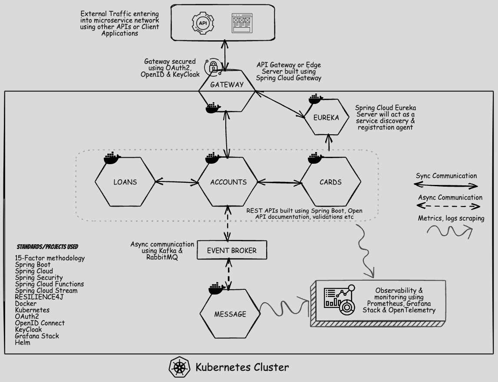

# Banking System – Microservices Architecture

A scalable and resilient banking system built using modern microservices architecture. The system is designed to handle core banking operations such as accounts, cards, and loans with high performance and fault tolerance.

## 🚀 Tech Stack

- **Backend:** Spring Boot, Spring Cloud
- **Architecture:** Microservices
- **Database:** MySQL
- **Messaging:** Apache Kafka
- **Containerization:** Docker
- **Orchestration:** Kubernetes
- **Monitoring & Observability:** Prometheus, Grafana, Zipkin

## 🔗 Communication

- **Synchronous:** REST APIs
- **Asynchronous:** Kafka Event Streaming

## ⚙️ Features

- Service discovery & centralized configuration
- API Gateway pattern
- Distributed tracing & centralized logging
- Fault tolerance & resilience
- Scalable deployment with Kubernetes

<h2 align="center">📁 Project Structure</h2>

  

